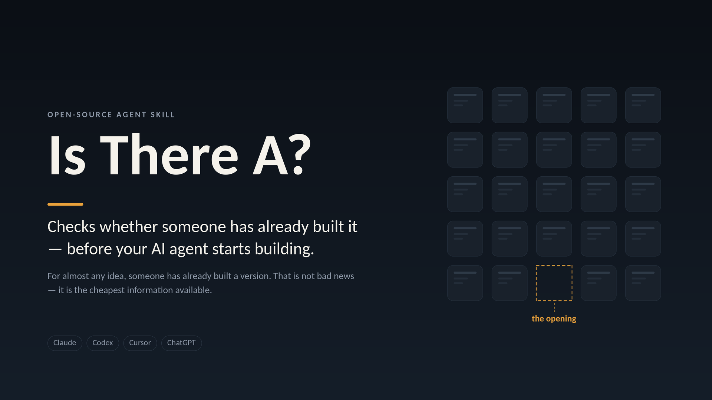

# Is There A?



**Checks whether someone has already built it — before your AI agent starts building.**

*Prior art check · competitor scan · "has someone built this already?" · market scan before building*

[](LICENSE)


For almost any idea, someone has already built a version of it. That's not bad news — it's the
cheapest information available. It shows what's solved, what's hard, what people complain about,
and where the actual opening is.

The expensive mistake isn't building something that exists. It's spending three weeks rebuilding it
*without knowing*, and finding out when you show a friend.

Two reasons this needs to be automatic rather than something you remember to do:

- **The person who most needs the check is the one who doesn't think to ask** — and often wouldn't
  know how to phrase the search if they did. Translating "I want to build a thing that…" into the
  words an existing product would actually use is most of the work.
- **Agents are tuned to execute.** Given "I want to build X", the default is to start building X.
  This inserts one cheap step before that reflex.

Works for software, and for physical products, brands, and services.

---

## What it does

1. **Writes the spec before searching** — idea, job, user, mechanism, and your *wedge* — because
   searching your product name instead of your problem is why most competitor checks come back
   empty.
2. **Searches across the naming gap** — four different vocabularies (yours, a vendor's, a frustrated
   user's, the adjacent category's) across the surfaces that match what you're making. A CPG idea
   goes to Amazon, Kickstarter and trade press; a dev tool goes to GitHub and Show HN.
3. **Sorts what it finds** into Direct hits, Adjacent, Components you can build on, and the
   Graveyard — abandoned attempts, which tell you the failure mode. **Every group reports its status
   even when empty**, so you always know whether something was searched or just found nothing.
4. **Names what people do today with no product at all** — the group chat, the spreadsheet, the
   paper sign. That's usually the real incumbent, and plugging into it often beats replacing it.
5. **Finds gaps from evidence** — 1-star reviews, long-open issues, churn threads, pricing that
   excludes people. Never from imagination; guesses are labelled as hypotheses.
6. **Gives one verdict** — build it, build it narrower, wrap it, fork it, it already exists, or
   reframe it — with confidence and what you might know that would flip it.
7. **Hands the conversation back** with questions, not more documents. It won't generate specs or
   dashboards unless you ask.

It's an advisor, not a gatekeeper. "This exists" is never by itself a reason to stop — most good
products are the fifth entrant. Say skip and it gets out of the way.

---

## Two modes, and what they cost

You're asked which one you want, with the numbers attached, before anything runs.

| Mode | Time | Tokens | Output |
|---|---|---|---|
| **Quick** (default) | ~2 min | ~50k | Summary in chat |
| **Standard** | ~10–15 min | ~150–300k | `LANDSCAPE.md` + short summary |

Quick is the default on purpose. Scanning is naturally iterative — a cheap scan tells you whether
depth is worth it, and tells a deeper scan what to look for.

### How a skill uses tokens (if you're new to this)

Installing a skill does **not** make every conversation more expensive. Skills load in three stages:

- **Always loaded:** just the name and one-line description — around 200 tokens, about a paragraph.
  That's the entire cost of having this installed in a chat where it never comes up.
- **Loaded when it triggers:** the instructions, around 2,500 tokens.
- **Loaded only if needed:** the reference files, and only the relevant one.

So the overhead of keeping it installed is negligible. The real cost is the scan itself, which is
why the mode is offered with numbers rather than chosen for you.

---

## Install

**Claude Code** — one line:

```
/plugin marketplace add n-any-i/is-there-a
/plugin install is-there-a@is-there-a
```

**Claude Cowork / claude.ai** — save `SKILL-standalone.md` as a skill (single file, references
inlined).

**Codex, Cursor, Aider, Windsurf, Gemini CLI, Copilot** — copy `AGENTS.md` into your project root.

**ChatGPT, Gemini, anything else** — paste a block from `prompt.md` into custom instructions.

Full step-by-step for each, plus three tests to check it's working: **[INSTALL.md](INSTALL.md)**.

---

## Files

| File | For |
|---|---|
| `skills/is-there-a/SKILL.md` | The skill itself — triggers on build intent |
| `skills/is-there-a/references/` | Search playbook, verdict rubric, no-search fallback — loaded only when needed |
| `skills/is-there-a/assets/` | The report template |
| `SKILL-standalone.md` | Single-file edition, for saving as a skill to your account |
| `AGENTS.md` | Codex, Cursor and others — standalone, self-contained |
| `prompt.md` | Copy-paste prompt for any instructions box (full + compact) |
| `INSTALL.md` | Setup for every tool, and how to test it |
| `media/` | Cover images and the one-page guide |

`SKILL.md`, `SKILL-standalone.md`, `AGENTS.md` and `prompt.md` describe the same method at four
levels of detail. Edit the one you use; if you change the method itself, update all four.

---

## Example

Illustrative — the shape of the exchange, not a real scan:

> **You:** I want to build a CLI that turns my git history into a weekly changelog.
>
> **Agent:** Before we build — want me to check what already exists? Quick (~2 min, ~50k tokens) or
> Standard (~10–15 min, written report)?
>
> **You:** quick
>
> *[scan runs]*
>
> **Agent:** Closest thing is `git-cliff` — a mature, actively maintained changelog generator built
> on conventional commits. That assumption is the seam: it needs disciplined commit messages, which
> is exactly what your repos don't have. Open requests for LLM summarisation of messy history, no
> maintainer movement on them.
>
> **Verdict: build it narrower** — a summarisation layer on top of `git-cliff`'s parser rather than
> a new changelog tool. Confidence: medium. What would change my mind: if you're already on
> conventional commits, `git-cliff` alone probably covers you.
>
> I skipped npm and the app-store equivalents on this run. Want those, or shall we start on the
> summarisation layer?

---

## Tuning it

- **Triggers too often?** Tighten the "doesn't apply" list in `SKILL.md` / `AGENTS.md`.
- **Scans too long?** Quick is already the default; cut its budget in the search playbook.
- **Results too shallow in your field?** Add the surfaces specific to your domain in
  `references/search-playbook.md` — one domain-specific directory beats three general queries.
- **Reports too long?** Trim groups from the template, but keep the status lines. Knowing what
  wasn't searched is the point.

---

## Limits worth knowing

- Scans go stale fast, especially in AI-adjacent categories. Date them and re-run before any real
  investment.
- Offline agents can still run the structural half, but their lists are unverified recall — treat
  every name as a lead, not a fact.
- Public footprints vary. Consumer apps, dev tools and civic projects are well documented; a
  regulated B2B niche where the competition is three private companies and an internal spreadsheet
  will return much less.
- This maps supply, not demand. It's no substitute for talking to people who have the problem.
