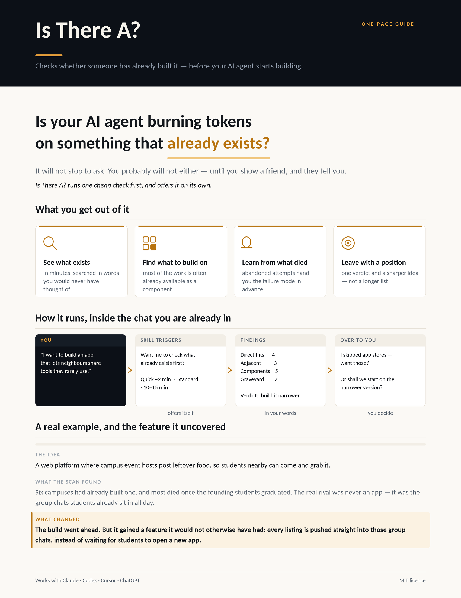

# Is There A?

**Checks whether someone has already built it — before your AI agent starts building.**

*Prior art check · competitor scan · "has someone built this already?" · market scan before building*

For almost any idea, someone has already built a version. That's not bad news — it's the cheapest
information available. It shows what's solved, what's hard, what people complain about, and where
the opening is.

Two habits get in the way. **You won't think to check** — "has someone done this?" tends to occur to
you in week three, usually right after you show a friend. And **agents execute by default**: say
"build me X" and an AI starts building X, without pausing to ask whether X exists.

This runs one cheap check first, and offers it on its own. Works for software, and for physical
products, brands and services.

---

## What it does

1. **Writes the spec before searching** — idea, job, user, mechanism, and your *wedge*. Searching
   your product name instead of your problem is why most competitor checks come back empty.
2. **Searches across the naming gap** — four vocabularies (yours, a vendor's, a frustrated user's,
   the adjacent category's), on the surfaces that match what you're making. A food brand goes to
   Amazon, Kickstarter and trade press; a dev tool goes to GitHub and Show HN.
3. **Sorts what it finds** — Direct hits · Adjacent · Components you can build on · Graveyard.
   Every group reports its status even when empty, so you always know what was searched versus
   what was found.
4. **Names what people do today with no product at all** — the group chat, the spreadsheet, the
   paper sign. Usually the real incumbent, and plugging into it often beats replacing it.
5. **Finds gaps from evidence** — 1-star reviews, long-open issues, churn threads. Guesses are
   labelled as guesses.
6. **Gives one verdict** — build it, build it narrower, wrap it, fork it, it already exists, or
   reframe it — with what you might know that would flip it.
7. **Hands the conversation back** with questions, not more documents.

Advisor, not gatekeeper. "This exists" is never by itself a reason to stop — most good products are
the fifth entrant. Say skip and it gets out of the way.

---

## Two modes, and what they cost

You're asked which one you want, with the numbers attached, before anything runs.

| Mode | Time | Tokens | Output |
|---|---|---|---|
| **Quick** (default) | ~2 min | ~50k | Summary in chat |
| **Standard** | ~10–15 min | ~150–300k | `LANDSCAPE.md` + short summary |

**Having it installed costs almost nothing.** Only the name and description stay loaded in every
conversation — about 200 tokens. The instructions (~2,500) load only when it triggers, and the
reference files only when a scan needs them. The scan itself is the real cost, which is why the
mode is offered with numbers rather than chosen for you.

---

## Install

| Your tool | Do this |
|---|---|
| **Claude Code** | `/plugin marketplace add n-any-i/is-there-a` then `/plugin install is-there-a@is-there-a` |
| **Claude apps** (Cowork, chat) | Upload [`dist/is-there-a.zip`](dist/is-there-a.zip) under Settings → Skills |
| **Codex, Cursor, Copilot** | Copy [`AGENTS.md`](AGENTS.md) into your project root |
| **ChatGPT, Gemini** | Paste a block from [`prompt.md`](prompt.md) into custom instructions |

Step-by-step for each, plus three tests to confirm it's working: **[INSTALL.md](INSTALL.md)**.

---

## Files

| File | For |
|---|---|
| [skills/is-there-a/SKILL.md](skills/is-there-a/SKILL.md) | The skill itself — triggers on build intent |
| [references/search-playbook.md](skills/is-there-a/references/search-playbook.md) | Surfaces by product type, query patterns, complaint mining |
| [references/verdict-rubric.md](skills/is-there-a/references/verdict-rubric.md) | Choosing between build / narrower / wrap / fork / use / reframe |
| [references/no-search-fallback.md](skills/is-there-a/references/no-search-fallback.md) | Running an honest scan with no web access |
| [assets/LANDSCAPE-template.md](skills/is-there-a/assets/LANDSCAPE-template.md) | The report structure |
| [SKILL-standalone.md](SKILL-standalone.md) | Single-file edition — everything inlined |
| [AGENTS.md](AGENTS.md) | Codex, Cursor and others — self-contained |
| [prompt.md](prompt.md) | Copy-paste prompt for any instructions box |
| [dist/is-there-a.zip](dist/is-there-a.zip) | Ready to upload to the Claude apps |

`SKILL.md`, `SKILL-standalone.md`, `AGENTS.md` and `prompt.md` are the same method at four levels of
detail. Edit the one you use; if you change the method, update all four.

---

## Example

Illustrative — the shape of the exchange, not a real scan:

> **You:** I want to build a CLI that turns my git history into a weekly changelog.
>
> **Agent:** Before we build — want me to check what already exists? Quick (~2 min, ~50k tokens) or
> Standard (~10–15 min, written report)?
>
> **You:** quick
>
> **Agent:** Closest thing is `git-cliff` — mature, actively maintained, built on conventional
> commits. That assumption is the seam: it needs disciplined commit messages, which is exactly what
> your repos don't have. Open requests for LLM summarisation of messy history, no maintainer
> movement on them.
>
> **Verdict: build it narrower** — a summarisation layer on top of `git-cliff`'s parser rather than
> a new changelog tool. What would change my mind: if you're already on conventional commits,
> `git-cliff` alone probably covers you.
>
> I skipped npm on this run. Want that, or shall we start on the summarisation layer?

---

## Tuning and limits

- **Triggers too often?** Tighten the "doesn't apply" list in `SKILL.md`.
- **Too shallow in your field?** Add your domain's surfaces to the search playbook — one
  domain-specific directory beats three general queries.
- **Reports too long?** Trim groups from the template, but keep the status lines. Knowing what
  wasn't searched is the point.

Scans go stale fast, especially in AI-adjacent categories — date them and re-run before any real
investment. Offline agents can still do the structural half, but their lists are unverified recall.
And this maps supply, not demand: it's no substitute for talking to people who have the problem.
